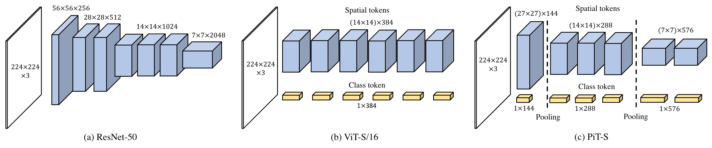

# PiT-Paddle-master

</img>

This is an unofficial Paddle implementation of [Rethinking Spatial Dimensions of Vision Transformers](https://arxiv.org/abs/2103.16302) (Byeongho Heo et al. 2018).

## Contents
1. [Introduction](#introduction)
2. [Reprod_Log](#reprod-log)
3. [Environment](#environment)
4. [How to use model](#how-to-use-model)


## Introduction

**Reference Code：**[pit](https://github.com/naver-ai/pit)

**Paper：**[Rethinking Spatial Dimensions of Vision Transformers](https://arxiv.org/abs/2103.16302)

Vision Transformer (ViT) extends the application range of transformers from language processing to computer vision tasks as being an alternative architecture against the existing convolutional neural networks (CNN). Since the transformer-based architecture has been innovative for computer vision modeling, the design convention towards an effective architecture has been less studied yet. From the successful design principles of CNN, we investigate the role of the spatial dimension conversion and its effectiveness on the transformer-based architecture. We particularly attend the dimension reduction principle of CNNs; as the depth increases, a conventional CNN increases channel dimension and decreases spatial dimensions. We empirically show that such a spatial dimension reduction is beneficial to a transformer architecture as well, and propose a novel Pooling-based Vision Transformer (PiT) upon the original ViT model. We show that PiT achieves the improved model capability and generalization performance against ViT. Throughout the extensive experiments, we further show PiT outperforms the baseline on several tasks such as image classification, object detection and robustness evaluation.


## Reprod Log
Based on 'reprod_log' model, the following documents are produced.
```
log_reprod
├── forward_paddle.npy
├── forward_torch.npy
├── metric_paddle.npy
├── metric_torch.npy
├── loss_paddle.npy
├── loss_torch.npy
├── bp_align_paddle.npy
├── bp_align_torch.npy
```

Based on 'ReprodDiffHelper' model, the following five log files are produced.

```
├── forward_diff.log
├── metric_diff.log
├── loss_diff.log
├── bp_align_diff.log
```


## Environment
- Frameworks: 
* [PaddlePaddle](https://paddlepaddle.org.cn/) (2.1.2)
* [NumPy](http://www.numpy.org/) (1.14.2)


## How to use models

You can build PiT models directly

```Python
import paddle
import pit

model = pit.pit_ti(pretrained=False)
model.load_state_dict(torch.load('./weights/pit_s_809.pth'))
print(model(torch.randn(1, 3, 224, 224)))

